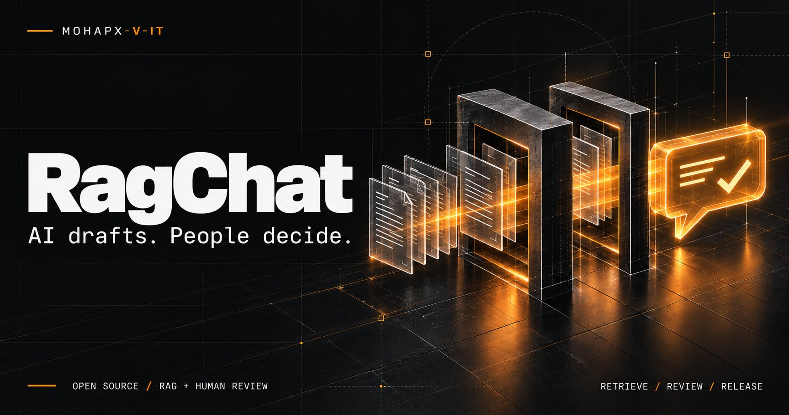
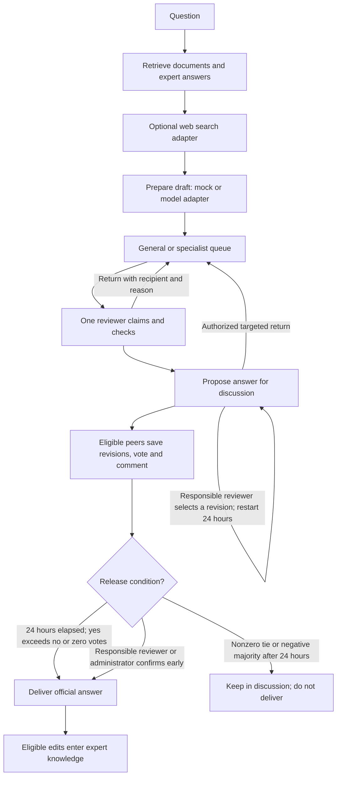

# RagChat

**AI drafts. People decide.**

**English** · [Русский](README.ru.md)

A self-hosted, open-source starter for knowledge-based chat with **human review before delivery**. RagChat brings questions, retrieved evidence, AI drafts, expert corrections, peer discussion, notifications, and reusable answers into one workflow.

The central idea: **generating an answer and authorizing its delivery are different jobs.**

Useful for internal support, employee onboarding, product knowledge, and operational guidance—where a fast draft helps, but an unreviewed answer should not become the organization's official response.

> **Status:** an extensible starter, not a turnkey enterprise platform. The UI is currently Russian; documentation is available in English and Russian. No company data, existing accounts, documents, model credentials, or search provider are bundled. The default model is a clearly labeled mock and the knowledge base is empty.

[Quick start](#quick-start) · [Workflow](#how-it-works) · [Why RagChat](#why-choose-ragchat) · [Integrations](#connect-your-model-search-and-knowledge) · [Limitations](#current-limitations) · [Contributing](CONTRIBUTING.md) · [MIT license](LICENSE)

## The problems it addresses

| Problem | RagChat's approach |
|---|---|
| A plausible AI response is mistaken for an approved answer. | Drafts enter a review queue; requesters receive the released answer. |
| Questions and corrections get lost in separate chats. | Each question has a task, owner, history, discussion, and delivery state. |
| Experts repeat the same corrections. | Eligible corrected answers become retrievable expert knowledge after delivery. |
| Nobody knows who is handling a question. | Exclusive claiming, availability statuses, assignment, targeted returns, and workload visibility. |
| Delays surface only after someone complains. | Stage timing, review reminders, manager escalation, and analytics. |
| Changing models means rebuilding the application. | An HTTP adapter separates the selected model from the workflow and UI. |
| A template carries another organization's data and keys. | Empty knowledge storage, generated bootstrap secrets, and explicitly configured integrations. |

The system makes review and ownership explicit. It does **not** guarantee factual correctness, eliminate hallucinations, or replace your organization's approval policy.

## Why choose RagChat?

The main differentiator is the **workflow around the answer**, not a claim of superior model intelligence. These are architectural comparisons, not benchmarks or claims about every competing product:

| Starting point | What RagChat adds | Trade-off |
|---|---|---|
| A chat interface returning model responses directly | A delivery gate, responsible reviewer, discussion, and audit | Users wait for review rather than receiving instant replies. |
| A document-search/RAG prototype | Accounts, operational queues, roles, notifications, and reusable corrections | The supplied retriever remains intentionally basic. |
| A helpdesk process without AI drafting | A place to combine retrieved evidence and generated drafts | Model/search adapters need implementation and evaluation. |
| A provider-specific integration | Replaceable model/search contracts and your own deployment | You operate the infrastructure and govern the data. |

**Choose it when** you need a customizable, review-first assistant and have a team to run it. **Consider another approach when** you need immediate autonomous answers, advanced semantic retrieval out of the box, multi-tenant SaaS, or a fully managed service with support guarantees.

## Included features

- **Requester workspace:** multiple chats, automatic titles, search and filters, answer ratings with negative-feedback reasons, answer copying.
- **Review workspace:** general/specialist queues, exclusive claiming, priorities, assignment, draft editing, templates, comments, response versions, targeted returns, peer discussion.
- **Management workspace:** team visibility, lifecycle events, stage timing, overdue-work visibility, reminders, analytics exports.
- **Administration:** account/role management, permission overrides, documents, expert knowledge, audit events, system diagnostics.
- **Knowledge foundation:** text-PDF ingestion, document versions, restoration, deletion, reindexing, separate expert-answer storage.
- **Delivery:** in-app notifications, optional SMTP email, optional Web Push/PWA.
- **Deployment:** Compose services, persistent storage, optional Caddy HTTPS entry point.

Permissions are also constrained by role, queue, ownership, and discussion rules. A permission override does not grant unrestricted access to every workflow.

## How it works



### Rules worth knowing

1. A question creates a task. Different chats may have pending tasks, but each chat allows only one unanswered question at a time.
2. Evidence is retrieved before draft generation. The mock produces an explicit technical placeholder, not a factual AI answer.
3. Routing uses configured keywords: `GENERAL` by default, `SPECIALIST` when a phrase matches. The bundled classifier is **not an AI classifier**.
4. Only one reviewer can claim the task. Non-administrators cannot review their own questions.
5. The reviewer checks or edits the answer, then proposes it for discussion. This first approval **does not deliver the answer**.
6. Eligible experts from both pools and administrators can participate. Each voter has one changeable vote. The responsible reviewer, selected revision author and question author cannot vote on that answer.
7. After 24 hours, the scheduler releases the **current selected answer** when yes exceeds no, or when a new discussion round has zero votes. A nonzero tie or negative majority leaves it in discussion. Pre-upgrade rounds keep their original strict-majority policy. Voting closes at the deadline; comments remain available.
8. The current responsible reviewer or an authorized administrator can release early, including when negative votes exist. The action is audited. Change this policy before deployment if you require a quorum or prohibit overrides.
9. A return requires a named expert and a reason. It is pinned for that expert and routed to their pool. Assignment protection is temporary, not a permanent private queue. A new proposal starts a new version and voting period.
10. Opening a question leads to a dedicated page with the question, owner, current answer, votes, independent editor, named revisions and team comments. Each save creates an immutable revision without replacing colleagues' texts. During discussion, only the responsible reviewer (or an authorized administrator) selects a revision: the previous round is archived, votes reset, and a fresh 24-hour period starts. Requesters see only their question status and delivered answer.
11. Corrected answers from the **general** pool enter expert knowledge after delivery. Unchanged drafts and specialist-pool answers do not automatically enter this store. Indexing status is tracked; failed indexing needs investigation.

Learning means **retrieving stored, reviewed answers**—not updating model weights or automatic fine-tuning.

### Independent revisions, not a shared overwriteable document

Questions now open on a dedicated page rather than a queue overlay. It shows the question, requester, responsible reviewer, current answer, votes, and revisions. Stage-time, claim-verification, internal-document, and internet-source blocks have been removed from this page; diagnostic evidence and metrics are not inserted into the draft text.

Each eligible expert edits **their own copy**. This is not simultaneous editing of a shared document. Saving creates a named, immutable revision; another save creates another entry without overwriting a colleague's text. Unsaved work can be recovered from the browser's local storage, so do not share browser profiles when handling sensitive content.

Saving a revision **does not deliver an answer**, replace the active text, reset votes, or extend the deadline. Once discussion starts, the current responsible reviewer can select a saved revision. It becomes the current answer; the previous round and its votes are archived, counts reset, and a fresh 24-hour deadline starts from selection. This cycle may repeat. Administrators retain administrative overrides; ordinary peers cannot select on the owner's behalf.

| Current round at its 24-hour deadline | Outcome |
|---|---|
| Yes exceeds no | Deliver the current answer. |
| No votes: 0 / 0 | Deliver the current answer in new rounds: the original proposal if no revision was selected, otherwise the selected revision. |
| Nonzero tie or no exceeds yes | Do not deliver; keep discussion available for comments and another revision. |

Early approval by the responsible reviewer or administrator delivers the current answer without waiting for the deadline or majority. Votes on an expired round are closed; selecting a different revision opens a new round. The background scheduler processes due tasks on its next pass, not with a second-accurate delivery guarantee. Requesters do not see the editor, revisions, internal comments, or votes: only processing status and the official answer.

### A unified draft, not a retrieval report

With adapters configured, the model receives document, expert-answer, and web-search context together. Instructions request concise but complete prose without separate knowledge/web sections, bibliographies, or citation labels. A final cleanup removes technical references and source sections without truncating the substantive answer. Uncertainty and limitations should remain. Evidence stays in separate diagnostic metadata; a missing search provider does not mean that no information exists online. Mock mode does not research or invent factual answers.

## Roles

| Role | Default responsibilities |
|---|---|
| Requester — `REQUESTER` | Personal chats, questions, released answers, ratings, notifications. |
| Expert — `EXPERT` | General queue, peer discussion, expert-knowledge management. |
| Specialist — `SPECIALIST` | Specialist queue and cross-pool discussion. |
| Manager — `MANAGER` | Own questions, team oversight, review of both queues, analytics, reminders. Not a peer-voting role. |
| Administrator — `ADMIN` | All workspaces, users, permissions, documents, audit, diagnostics, administrative review overrides. |

Administrators create accounts. There is no public self-registration. Roles describe application responsibilities rather than industry-specific job titles.

## Quick start

These are instructions for your own deployment; the complete container stack has not been validated end to end. See [validation notes](docs/VALIDATION.md).

### 1. Prepare configuration

Download or clone your repository copy and open its root in a terminal. Install Node.js 24+ and Docker with Compose v2.

```sh
node scripts/setup.mjs
```

This generates `.env` with random database, JWT, internal-service, and administrator secrets. It refuses to overwrite an existing `.env`; inspect an existing file locally rather than deleting it blindly.

Before the first start, replace the placeholder `ADMIN_EMAIL` with the first administrator's email. Read `ADMIN_PASSWORD` locally. Never paste credentials into issues or commit `.env`.

### 2. Start the stack

```sh
docker compose up -d --build
docker compose ps
```

Open [http://localhost:8088](http://localhost:8088) and sign in using the administrator credentials from `.env`. No model API key is required for the mock workflow.

The administrator is bootstrapped into a new database. Changing `ADMIN_PASSWORD` later does not reset an existing account; use user administration.

### 3. Test a complete question lifecycle

1. Create a requester and two experts. Use separate browser profiles/private windows for independent sessions.
2. Optionally upload a small PDF with selectable text through document management. The knowledge base starts empty.
3. As requester, create a chat and ask about the document.
4. As the first expert, claim the task, open its page, write a meaningful test answer in your independent editor, and save the revision.
5. Propose the initial draft for discussion, then select your saved revision. Verify the replacement, reset vote counts, and new deadline.
6. As the second expert, open the discussion, save another revision, and vote on the current answer. Saving alone must not change the active answer, votes, or deadline. If appropriate, the responsible reviewer selects the second expert's revision and starts another round.
7. For immediate delivery, return as the current responsible reviewer and release early. Otherwise follow the documented 24-hour rules.
8. As the requester, verify receipt of the final text and absence of internal discussions. Check rating, history, and expert-knowledge indexing for an edited general-pool answer.

This exercises workflow, not the quality of a real model or retriever.

### 4. Inspect or stop

```sh
docker compose logs --tail=100 api rag-api
docker compose down
```

Shutdown preserves named volumes. **Do not use `docker compose down -v` unless you intend to erase stored data.** Logs and backups may contain sensitive information.

## Connect your model, search, and knowledge

### Model adapter

The service expects **your custom HTTP adapter**, not an arbitrary vendor endpoint. The adapter translates RagChat requests into your cloud or local model's protocol.

```dotenv
MODEL_PROVIDER=http
MODEL_ADAPTER_URL=https://model-adapter.example.org/draft
MODEL_API_KEY=
```

Replace the example URL; set the key if the adapter needs Bearer authentication. Requests contain `question`, `history`, `documents`, `expertKnowledge`, `webSources`, `searchStatus`, and grounding instructions. Expected response:

```json
{
  "text": "A draft grounded in the supplied evidence.",
  "metrics": {"promptTokens": 100, "completionTokens": 80, "totalTokens": 180, "llmMs": 1500}
}
```

`text` is required; metrics are optional. The adapter handles provider authentication, model selection, and accurate usage reporting. Honor the supplied synthesis instructions: produce one complete prose answer without bibliographies, URLs, numbered source sections or citation markers. Document and web evidence remain separate response metadata. Calls have a 55-second timeout and do not follow redirects. Keys stay in server configuration, not browser settings.

### Web-search adapter

```dotenv
SEARCH_ADAPTER_URL=https://search-adapter.example.org/search
SEARCH_API_KEY=
```

The adapter receives `{"query":"the user's question"}` and returns:

```json
{
  "sources": [
    {"url": "https://example.org/reference", "title": "Reference page", "text": "Relevant page content."}
  ]
}
```

Up to eight HTTP(S) sources are passed to the model alongside internal evidence. The source catalog annotates domains; it is not a restrictive search allowlist. The adapter performs discovery/page reading, handles provider limits and network safety, and treats retrieved text as untrusted data.

Search status is explicit: `not_configured`, `ok`, `empty`, or `unavailable`. An unavailable search service is not evidence that information does not exist. **A model connection does not itself enable web search.** A configured search adapter can run even in mock-model mode; leave its URL empty for an entirely local mock workflow.

After changing integration variables:

```sh
docker compose up -d --force-recreate rag-api
```

See [adapter contracts](docs/ADAPTERS.md) for additional details (Russian reference; the essential contracts are shown above).

### Knowledge and retrieval

- Text PDFs are parsed locally and split into page-referenced passages. OCR is not included.
- RAG accepts up to 50 MiB and 1,000 pages per PDF. Encrypted/no-text files are rejected; an upstream proxy may impose a smaller limit.
- Uploading the same filename creates a version. Restore versions, delete documents, or reindex current documents. Deleting a document also removes its stored versions.
- Expert answers are stored separately and can be edited or deactivated.
- The baseline retrieves up to six document passages and four expert answers using lexical token overlap. It is **not a vector database, embedding model, or semantic reranker**.
- Replace `retrieve()` in `rag-service/main.py` for vector/hybrid retrieval while preserving its result structures.
- Configure comma-separated `SPECIALIST_KEYWORDS`, or replace `/v1/classify` with your own classifier.

An external model adapter receives questions, conversation history, and selected evidence. A search adapter receives the question. Establish permitted data flows before enabling either.

## Notifications and PWA

In-app events work without an external provider. External channels require configuration:

| Event | Recipients / behavior |
|---|---|
| Question submitted | Managers receive lifecycle visibility. |
| Draft ready | Eligible reviewers, subject to routing/availability. |
| Task claimed | Requester and managers see reviewer and question context. |
| Assigned review unfinished for 15 minutes | Assigned reviewer gets a reminder, with optional email/push. |
| Assigned review unfinished for 30 minutes | Reviewer and managers receive escalation. |
| Answer released | Requester and managers; optional requester email. |
| Targeted return | Named expert receives return context. |

Timers run from assignment during active review, not original submission or peer discussion. Background checks are periodic, so notifications are not guaranteed at the exact second.

For email configure `SMTP_HOST`, `SMTP_PORT`, `SMTP_USER`, `SMTP_PASSWORD`, `SMTP_FROM`. Without SMTP, payloads are saved to a **local outbox**, not sent. This is a diagnostic record, not a guaranteed future-delivery queue.

For Web Push generate your own VAPID pair:

```sh
npm ci
npx web-push generate-vapid-keys
```

Set `VAPID_PUBLIC_KEY`, `VAPID_PRIVATE_KEY`, and your contact URI in `VAPID_SUBJECT`. Recreate `api` after environment changes. Each device needs permission and a subscription. Use HTTPS for production PWA/push; supported iOS usage requires Home Screen installation. Browser/OS restrictions, connectivity, and expired subscriptions can prevent delivery. A bell notification does not prove that a phone received a push.

## Architecture and persistence

```text
Browser / PWA
      |
Web frontend + reverse proxy
      |
Node.js API ---------------- PostgreSQL
      |
Python retrieval service --- SQLite documents / passages / expert answers
      |
      +--------------------- Optional model HTTP adapter
      +--------------------- Optional search HTTP adapter
```

| Component | Responsibility |
|---|---|
| `web/`: React, TypeScript, Vite | Role-based UI, chat, queues, discussion, mobile layout, PWA. |
| `api/`: Node.js, Express | Authentication, authorization, workflow, notifications, audit, analytics. |
| PostgreSQL | Accounts with password hashes, chats, tasks, votes, histories, application state. |
| `rag-service/`: Python, FastAPI, SQLite | Document versions, lexical retrieval, expert knowledge, adapter calls. |
| Nginx / optional Caddy | Web serving, API proxying, optional public HTTPS. |

Compose persists `postgres_data`, `rag_data`, `api_data`, plus Caddy state in the production profile. Back up **both application and retrieval data**. Changing models does not back up or migrate databases.

Only the web port is published on loopback by default. API, database, and RAG stay inside the Compose network. The Node API uses an in-memory application-state cache and background jobs: run **one API process** until shared-state coordination and distributed jobs are implemented.

## Configuration overview

| Variables | Purpose |
|---|---|
| `POSTGRES_DB`, `POSTGRES_USER`, `POSTGRES_PASSWORD` | Application database. |
| `JWT_SECRET`, `INTERNAL_SERVICE_TOKEN` | User-token signing and API-to-RAG authentication. |
| `ADMIN_EMAIL`, `ADMIN_PASSWORD` | Initial administrator on an empty database. |
| `WEB_PORT`, `WEB_ORIGIN`, `APP_DOMAIN` | Local port, allowed browser origin, public domain. |
| `MODEL_PROVIDER`, `MODEL_ADAPTER_URL`, `MODEL_API_KEY` | Mock or custom model adapter. |
| `SEARCH_ADAPTER_URL`, `SEARCH_API_KEY` | Optional web search. |
| `SPECIALIST_KEYWORDS` | Specialist-routing phrases. |
| `SMTP_*`, `VAPID_*` | Email and Web Push. |

Full template: [.env.example](.env.example). Local `.env` is ignored by Git. The in-app FAQ explains usage; it is not the retrieval corpus.

## Development and checks

Use Node.js 24+. The RAG container uses Python 3.12; the recorded local test run used Python 3.14.

```sh
npm ci
npm test
npm run build
npm run check
```

Python, Linux/macOS:

```sh
python3 -m venv .venv
.venv/bin/python -m pip install -r rag-service/requirements.txt
cd rag-service
../.venv/bin/python -m unittest -v
```

Python, Windows PowerShell, starting in the repository root:

```powershell
py -m venv .venv
.\.venv\Scripts\python.exe -m pip install -r rag-service/requirements.txt
Push-Location rag-service
..\.venv\Scripts\python.exe -m unittest -v
Pop-Location
```

`npm run dev` starts **only** Vite on port 5173; its proxy expects API port 3001. It does not start PostgreSQL or Python. A visible login page is not evidence that authenticated workflows work.

Recorded verification: **50 API tests, 13 RAG tests, successful frontend build**. These are focused tests, not production certification. The source checker is heuristic, not comprehensive secret detection. See [validation record](docs/VALIDATION.md).

## Building a portable release

Version **0.2.0** includes the updated question page, independent expert revisions, responsible-reviewer selection, restarted voting rounds, and unified draft text. See [CHANGELOG.md](CHANGELOG.md).

After installing the development dependencies and Python requirements described above:

```sh
npm test
npm run test:rag
npm run build
npm run check
npm run release
```

The release command creates `RagChat-0.2.0.zip` in the parent directory and refuses to overwrite an existing release by default. To explicitly refresh a previously generated archive, use `npm run release -- --replace`. It includes source, documentation, deployment templates, and the built frontend. It excludes local credentials, databases, knowledge documents, logs, installed dependencies, and Git history. On a new machine, install dependencies and generate your own configuration before starting the stack. None of these commands starts Docker.

## Deploying your instance

1. Provision infrastructure/DNS. Set `APP_DOMAIN` to your hostname and `WEB_ORIGIN` to its HTTPS origin.
2. Use unique secrets and integration accounts. Never reuse another installation's database or credentials.
3. Review access policy, early-release rules, retention, permitted data, and source handling.
4. Configure firewall/HTTPS, then run the public profile:

   ```sh
   docker compose --profile production up -d --build
   ```

5. Configure backups and test restoration of PostgreSQL and RAG data.
6. Test login, both queues, returns, voting, release, indexing, email, push, and failure recovery before onboarding users.
7. Monitor adapter/indexing failures, backlog, storage, and actual delivery. Token/cost reporting depends on supplied metrics and pricing configuration; it is not a provider invoice.

Read [SECURITY.md](SECURITY.md). The template is not a security or compliance certification.

## Troubleshooting

| Symptom | Check |
|---|---|
| Draft says no model is connected | Default `MODEL_PROVIDER=mock`; configure an adapter and recreate `rag-api`. |
| No internet evidence | Search URL, adapter response, `searchStatus`; a model key alone is insufficient. |
| Few relevant passages | PDF text, current versions, vocabulary overlap, lexical retrieval limitations. |
| Answer stays in discussion | Deadline, votes, current round policy and responsible reviewer. New zero-vote rounds release after 24 hours; old rounds keep their original rule. |
| Expert cannot claim | Pool, permissions, owner, own-question restriction, temporary assignment protection. |
| Email exists locally but never arrives | `local-outbox` means SMTP is absent; test actual SMTP delivery. |
| Bell works but no phone push | VAPID, device permission/subscription, HTTPS, OS/browser restrictions. |
| Corrected answer is not reused | General-pool eligibility, delivery, indexing status, activation, lexical match. |
| Health is green but model is silent | Health reports service/configuration state; run an adapter self-test and test question. |

## Current limitations

- Russian UI; no completed English localization.
- No bundled model, search engine, embeddings, vector store, reranker, or OCR.
- No measured superiority in accuracy, throughput, cost, or retrieval recall.
- No built-in SSO/MFA or comprehensive rate/abuse protection; add controls before public exposure.
- Not a multi-tenant SaaS and not ready for horizontal API scaling without changes.
- No automatic fine-tuning; reviewed corrections enrich retrieval evidence only.
- Human review does not guarantee correctness; early release can override negative votes.
- No guaranteed email/push delivery, exactly-once distributed workflow, or turnkey production backup/restore guarantee.
- Container builds currently install from component manifests; review lockfile-based builds and image pinning for reproducible releases.

## Contributing and license

Useful contributions: semantic/hybrid retrieval, tested provider adapters, English UI localization, accessibility testing, distributed jobs, and stronger deployment/security defaults. These are opportunities, not shipped capabilities or promised dates.

See [CONTRIBUTING.md](CONTRIBUTING.md). Keep examples synthetic and industry-neutral. Never submit real conversations, documents, passwords, `.env`, tokens, database dumps, or personal data.

[MIT license](LICENSE), subject to the publisher confirming distribution rights for derivative code and respecting third-party licenses. Paid model access, hosting, and support are not included.

## Repository artwork

The header uses a repository-relative path, so the image travels with a clone or fork. [PNG master](docs/assets/ragchat-cover.png) · [Lightweight preview](docs/assets/ragchat-social-preview.jpg) · [Artwork brief](docs/assets/COVER.md).

The illustration represents the workflow, not the interface. [Current login-screen screenshot](docs/preview.png).
