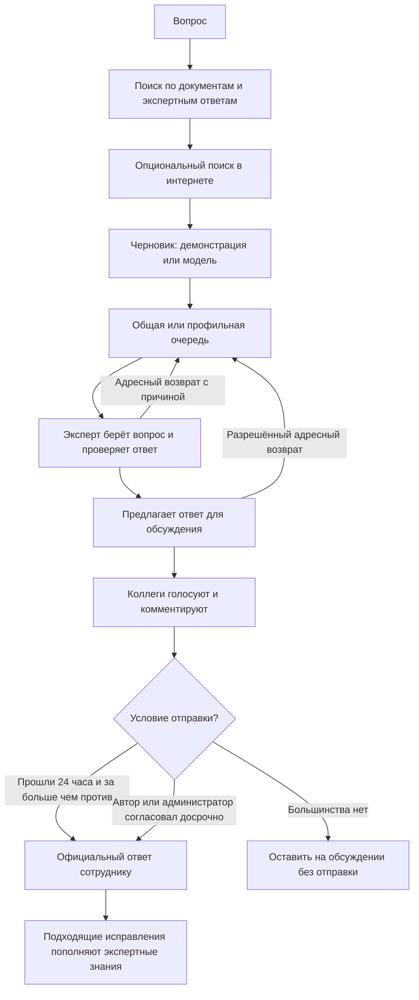

# RagChat

**ИИ готовит черновик. Решение принимают люди.**

[English](README.md) · **Русский**

Открытая основа для развёртывания собственного чата по базе знаний с **обязательной проверкой ответа человеком перед отправкой**. RagChat объединяет вопросы, найденные материалы, черновики ИИ, экспертные правки, обсуждения, уведомления и повторное использование согласованных ответов.

Главная идея: **сгенерировать ответ и разрешить его отправку — разные задачи.**

Проект подходит для внутренней поддержки, адаптации сотрудников, продуктовых консультаций и операционных инструкций: ИИ помогает подготовить материал, но его черновик не становится официальным ответом автоматически.

> **Состояние проекта:** расширяемая основа, а не готовая корпоративная платформа на все случаи. Интерфейс русскоязычный; документация доступна на русском и английском. В поставке нет данных компании, существующих аккаунтов, документов, ключей модели или подключённого поискового провайдера. По умолчанию включён явно обозначенный демонстрационный режим, база знаний пуста.

[Запуск](#быстрый-запуск) · [Процесс](#как-это-работает) · [Преимущества](#почему-стоит-выбрать-ragchat) · [Интеграции](#подключение-модели-поиска-и-базы-знаний) · [Ограничения](#текущие-ограничения) · [Участие в разработке](CONTRIBUTING.md) · [Лицензия MIT](LICENSE)

## Какие проблемы решает

| Проблема | Что предлагает RagChat |
|---|---|
| Правдоподобный ответ ИИ принимают за проверенный. | Черновик попадает в очередь проверки; сотрудник получает окончательно выпущенный ответ. |
| Вопросы и правки теряются в переписке. | У вопроса есть задача, исполнитель, история, обсуждение и состояние доставки. |
| Эксперты многократно исправляют одно и то же. | Подходящие исправленные ответы пополняют экспертную базу для следующих запросов. |
| Непонятно, кто занимается вопросом. | Взятие в работу одним исполнителем, статусы доступности, назначение, адресный возврат и видимость нагрузки. |
| О задержке узнают только после жалобы. | Время по этапам, напоминания исполнителю, уведомление руководителей и аналитика. |
| Для смены модели приходится переделывать приложение. | HTTP-адаптер отделяет выбранную модель от интерфейса и рабочего процесса. |
| Вместе с шаблоном переносятся чужие данные и ключи. | Пустое хранилище, новые локальные секреты и только явно настроенные интеграции. |

Система делает ответственность и порядок проверки понятными, но **не гарантирует достоверность**, не устраняет галлюцинации и не заменяет внутренние правила согласования.

## Почему стоит выбрать RagChat

Основное отличие — **процесс работы с ответом**, а не обещание превосходства встроенной модели. Ниже сравниваются подходы к построению системы, а не конкретные продукты. Это не результаты сравнительных испытаний:

| Отправная точка | Что добавляет RagChat | Компромисс |
|---|---|---|
| Чат, сразу отдающий ответ модели | Проверку перед отправкой, исполнителя, обсуждение и аудит | Пользователь ждёт согласования, а не получает мгновенный ответ. |
| Прототип поиска по документам или RAG | Пользователей, роли, рабочие очереди, уведомления и накопление исправлений | Поисковая реализация в комплекте намеренно базовая. |
| Обработка обращений без черновиков ИИ | Объединение найденных материалов и черновика перед проверкой | Модель и поиск нужно подключить и оценить самостоятельно. |
| Интеграция под одного провайдера | Заменяемые контракты модели и поиска, собственное развёртывание | Инфраструктура, адаптеры и управление данными остаются вашей ответственностью. |

**Выбирайте RagChat**, если нужен настраиваемый помощник с проверкой ответов и есть команда для его эксплуатации. **Рассмотрите другой подход**, если необходимы мгновенные автономные ответы, готовый высококачественный семантический поиск, SaaS для разных организаций или полностью управляемый сервис с гарантиями поддержки.

## Что входит в проект

- **Рабочее место сотрудника:** несколько чатов, автоматические названия, поиск и фильтры, оценки с причиной отрицательного отзыва, копирование ответа.
- **Рабочее место эксперта:** общая и профильная очереди, взятие вопроса одним исполнителем, приоритеты, назначение, редактирование, шаблоны, комментарии, версии, адресный возврат и обсуждение.
- **Рабочее место руководителя:** обзор команды, события по вопросам, время этапов, просроченные задачи, напоминания и экспорт аналитики.
- **Администрирование:** пользователи, роли, уточнение прав, документы, экспертные знания, аудит и диагностика.
- **Основа базы знаний:** текстовые PDF, версии, восстановление версии, удаление, переиндексация и отдельное хранилище экспертных ответов.
- **Уведомления:** внутри сервиса, опционально SMTP и Web Push/PWA.
- **Развёртывание:** сервисы Compose, постоянные хранилища, опциональный HTTPS через Caddy.

Доступ зависит от прав, роли, очереди и принадлежности задачи. Выдача отдельного разрешения не отменяет остальные ограничения роли или обсуждения.

## Как это работает



### Важные правила

1. Вопрос создаёт задачу. Можно ждать ответы в нескольких чатах, но в одном чате нельзя отправить следующий вопрос до завершения предыдущего.
2. Сервис находит материалы до подготовки черновика. Без модели это явно обозначенная техническая заготовка, а не содержательный ответ ИИ.
3. Направление определяется ключевыми фразами: по умолчанию `GENERAL`, при совпадении настроенной фразы — `SPECIALIST`. В комплекте **правила маршрутизации, а не ИИ-классификатор**.
4. Вопрос берёт один эксперт. Другой не может одновременно взять его себе. Не-администратор не проверяет собственный вопрос.
5. Исполнитель проверяет или исправляет текст и отправляет его на обсуждение. Первое согласование **ещё не отправляет ответ сотруднику**.
6. Участвуют допущенные эксперты обоих направлений и администраторы. У каждого голосующего один изменяемый голос. Автор предложенного ответа и автор вопроса не могут голосовать за этот ответ.
7. Через 24 часа фоновая проверка отправит ответ, только если **голосов «за» больше, чем «против»**. Ничья, отсутствие голосов и перевес отрицательных оставляют вопрос на обсуждении. Голосование закрывается по сроку, комментарии доступны. Молчание не считается согласием.
8. Автор предложения или уполномоченный администратор может согласовать досрочно, в том числе при отрицательных голосах. Действие фиксируется в аудите. Если нужен обязательный кворум или запрет такого решения, измените политику до внедрения.
9. Возврат требует выбранного эксперта и причины. Вопрос закрепляется сверху у адресата и возвращается в его очередь. Защита назначения временная, а не бессрочная. Новое предложение создаёт новую версию обсуждения и новый срок голосования.
10. После отправки исправленные ответы из **общей** очереди пополняют экспертную базу. Неизменённые черновики и ответы профильной очереди автоматически не добавляются. Статус индексации отслеживается; ошибки требуют проверки.

«Обучение» здесь — **использование сохранённых экспертных ответов при поиске**, а не изменение весов или автоматическое дообучение модели.

## Роли

| Роль | Доступ по умолчанию |
|---|---|
| Сотрудник — `REQUESTER` | Личные чаты, вопросы, окончательные ответы, оценки и уведомления. |
| Эксперт — `EXPERT` | Общая очередь, обсуждения, управление экспертными знаниями. |
| Профильный эксперт — `SPECIALIST` | Профильная очередь и обсуждение ответов обоих направлений. |
| Руководитель — `MANAGER` | Собственные вопросы, контроль команды, обработка обеих очередей, аналитика, напоминания. Не является голосующей ролью обсуждения. |
| Администратор — `ADMIN` | Все пространства, пользователи, права, документы, аудит, система и административные исключения проверки. |

Аккаунты создаёт администратор. Открытой самостоятельной регистрации нет. Роли описывают обязанности в приложении и не привязаны к отраслевым должностям.

## Быстрый запуск

Ниже инструкция для самостоятельного запуска. Она не означает, что полный стек уже проверен в Docker: см. [протокол проверки](docs/VALIDATION.md).

### 1. Подготовьте настройки

Скачайте или клонируйте свою копию репозитория и откройте терминал в его корне. Для настройки нужен Node.js 24+, для полного запуска — Docker с Compose v2.

```sh
node scripts/setup.mjs
```

Скрипт создаст `.env` со случайными секретами базы, JWT, межсервисного соединения и администратора. Существующий файл не перезаписывается: изучите его локально, не удаляйте ради повторного запуска.

До первого старта задайте адрес первого администратора в `ADMIN_EMAIL`. Сгенерированный `ADMIN_PASSWORD` прочитайте локально. Не отправляйте его в обсуждения и не добавляйте `.env` в Git. Адрес из шаблона — только пример.

### 2. Запустите сервисы

```sh
docker compose up -d --build
docker compose ps
```

Откройте [http://localhost:8088](http://localhost:8088) и войдите с данными администратора из `.env`. Для демонстрационного процесса ключ модели **не нужен**.

Первый администратор создаётся в новой базе. Изменение `ADMIN_PASSWORD` после этого не сбрасывает пароль существующей записи — используйте администрирование пользователей.

### 3. Проверьте путь вопроса

1. Создайте сотрудника и двух экспертов. Для независимых сессий используйте разные профили браузера или приватные окна.
2. При необходимости загрузите небольшой PDF с выделяемым текстом. Изначально база знаний пустая.
3. Под сотрудником создайте чат и задайте вопрос по документу.
4. Под первым экспертом возьмите вопрос и замените демонстрационную заготовку осмысленным тестовым ответом.
5. Отправьте ответ на обсуждение. Под вторым экспертом откройте его и проголосуйте.
6. Для немедленного завершения вернитесь под автором предложения и согласуйте досрочно. Иначе действует правило большинства через 24 часа.
7. Проверьте получение, оценку, историю и, для исправленного ответа общей очереди, статус индексации экспертного знания.

Это проверка рабочего процесса, а не качества реальной модели или поиска.

### 4. Посмотрите логи или остановите

```sh
docker compose logs --tail=100 api rag-api
docker compose down
```

Остановка сохраняет volumes. **Не используйте `docker compose down -v`, если не собираетесь удалить данные.** Логи и резервные копии могут содержать конфиденциальную информацию.

## Подключение модели, поиска и базы знаний

### Адаптер модели

RagChat ожидает **ваш HTTP-адаптер**, а не произвольный endpoint поставщика модели. Адаптер переводит запрос приложения в протокол выбранной облачной или локальной модели.

```dotenv
MODEL_PROVIDER=http
MODEL_ADAPTER_URL=https://model-adapter.example.org/draft
MODEL_API_KEY=
```

Замените пример адреса на свой. Ключ нужен при Bearer-аутентификации адаптера. В запрос входят `question`, `history`, `documents`, `expertKnowledge`, `webSources`, `searchStatus` и инструкции по источникам. Ответ адаптера:

```json
{
  "text": "Черновик с обоснованием на предоставленных источниках.",
  "metrics": {"promptTokens": 100, "completionTokens": 80, "totalTokens": 180, "llmMs": 1500}
}
```

`text` обязателен, метрики необязательны. Адаптер отвечает за аутентификацию провайдера, выбор модели, промпт, ссылки и достоверный учёт использования. Тайм-аут — 55 секунд, перенаправления не выполняются. Ключи задаются на сервере, не в браузере.

### Адаптер интернет-поиска

```dotenv
SEARCH_ADAPTER_URL=https://search-adapter.example.org/search
SEARCH_API_KEY=
```

Адаптер получает `{"query":"вопрос сотрудника"}` и возвращает:

```json
{
  "sources": [
    {"url": "https://example.org/reference", "title": "Справочная страница", "text": "Относящийся к вопросу фрагмент."}
  ]
}
```

До восьми HTTP(S)-источников передаются модели вместе с внутренними материалами. Каталог доменов служит для пометок, а не ограничения поиска белым списком. Адаптер ищет и читает страницы, соблюдает лимиты, обеспечивает сетевую безопасность и считает содержимое страниц недоверенными данными.

Состояние поиска: `not_configured`, `ok`, `empty` или `unavailable`. Сбой не означает, что информации в интернете нет. **Подключение API модели само по себе не включает интернет-поиск.** Настроенный поисковый адаптер вызывается и в демонстрационном режиме модели; для полностью локальной демонстрации оставьте его URL пустым.

После изменения переменных интеграции:

```sh
docker compose up -d --force-recreate rag-api
```

Подробности — в [контрактах адаптеров](docs/ADAPTERS.md).

### Документы и поиск по знаниям

- PDF с текстовым слоем разбивается локальным парсером на фрагменты с номерами страниц. OCR в комплекте нет.
- RAG принимает до 50 МиБ и 1 000 страниц на PDF. Зашифрованные файлы и документы без извлекаемого текста отклоняются; reverse proxy может устанавливать меньший предел.
- Повторная загрузка того же имени создаёт версию. Можно восстановить версию, удалить документ и переиндексировать текущие документы. Удаление документа удаляет и сохранённые версии.
- Экспертные ответы хранятся отдельно; их можно исправлять и деактивировать.
- Базовый поиск выбирает до шести фрагментов документов и четырёх экспертных ответов по совпадению слов. Это **не векторная база, не embeddings и не семантический reranker**.
- Для векторного/гибридного поиска замените `retrieve()` в `rag-service/main.py`, сохранив формат результата.
- Задайте `SPECIALIST_KEYWORDS` через запятую или замените `/v1/classify` своим классификатором.

Внешний адаптер модели получает вопрос, историю и выбранные материалы. Поисковый адаптер получает вопрос. Сначала определите, какие данные допустимо выводить за пределы своей инфраструктуры.

## Уведомления и PWA

Внутренние события не требуют внешнего провайдера. Для внешних каналов нужна настройка:

| Событие | Получатели и поведение |
|---|---|
| Создан вопрос | Руководители видят событие. |
| Черновик готов | Подходящие эксперты с учётом маршрутизации и доступности. |
| Вопрос взят | Автор и руководители получают контекст вопроса и исполнителя. |
| Назначенный вопрос не завершён за 15 минут | Напоминание исполнителю, опционально почта/push. |
| Назначенный вопрос не завершён за 30 минут | Эскалация исполнителю и руководителям. |
| Ответ отправлен | Автор и руководители; автору опционально письмо. |
| Адресный возврат | Указанный эксперт получает контекст возврата. |

Таймер отсчитывается с назначения в активную проверку, а не с создания вопроса или начала обсуждения. Фоновые проверки периодические, точность доставки до секунды не гарантируется.

Для почты заполните `SMTP_HOST`, `SMTP_PORT`, `SMTP_USER`, `SMTP_PASSWORD`, `SMTP_FROM`. Без SMTP письма записываются в **локальный outbox**, а не отправляются. Это диагностика, а не гарантия автоматической отправки в будущем.

Для Web Push создайте собственную пару VAPID:

```sh
npm ci
npx web-push generate-vapid-keys
```

Запишите ключи в `VAPID_PUBLIC_KEY`, `VAPID_PRIVATE_KEY`, контакт — в `VAPID_SUBJECT`. После изменения окружения пересоздайте `api`. Каждое устройство отдельно разрешает уведомления и регистрирует подписку. Для production нужны HTTPS и поддержка браузера; на поддерживаемых iOS требуется установка на домашний экран. Настройки ОС, сеть и истёкшая подписка могут препятствовать доставке. Колокольчик не доказывает получение push телефоном.

## Архитектура и хранение данных

```text
Браузер / PWA
      |
Веб-интерфейс + reverse proxy
      |
Node.js API ---------------- PostgreSQL
      |
Python RAG-сервис ----------- SQLite: документы, фрагменты, экспертные ответы
      |
      +--------------------- Опциональный HTTP-адаптер модели
      +--------------------- Опциональный HTTP-адаптер поиска
```

| Компонент | Назначение |
|---|---|
| `web/`: React, TypeScript, Vite | Ролевой интерфейс, чаты, очередь, обсуждения, мобильная вёрстка, PWA. |
| `api/`: Node.js, Express | Вход, права, рабочий процесс, уведомления, аудит, аналитика. |
| PostgreSQL | Пользователи с хэшами паролей, диалоги, задачи, голоса, история, состояние приложения. |
| `rag-service/`: Python, FastAPI, SQLite | Версии документов, лексический поиск, экспертные знания, вызовы адаптеров. |
| Nginx / опциональный Caddy | Раздача интерфейса, проксирование API, публичный HTTPS. |

В Compose используются `postgres_data`, `rag_data`, `api_data` и хранилища Caddy для production. Резервируйте **и основную базу, и RAG**. Смена модели не создаёт резервную копию и не переносит данные.

По умолчанию публикуется только веб-порт на loopback. API, база и RAG остаются во внутренней сети Compose. Node API использует кэш состояния в памяти и фоновые задачи: до реализации согласованности и распределённых заданий запускайте **один процесс API**.

## Основные настройки

| Переменные | Назначение |
|---|---|
| `POSTGRES_DB`, `POSTGRES_USER`, `POSTGRES_PASSWORD` | Основная база. |
| `JWT_SECRET`, `INTERNAL_SERVICE_TOKEN` | Подпись пользовательских токенов и связь API с RAG. |
| `ADMIN_EMAIL`, `ADMIN_PASSWORD` | Первый администратор в пустой базе. |
| `WEB_PORT`, `WEB_ORIGIN`, `APP_DOMAIN` | Локальный порт, допустимый origin, публичный домен. |
| `MODEL_PROVIDER`, `MODEL_ADAPTER_URL`, `MODEL_API_KEY` | Демонстрационная модель или адаптер. |
| `SEARCH_ADAPTER_URL`, `SEARCH_API_KEY` | Необязательный интернет-поиск. |
| `SPECIALIST_KEYWORDS` | Фразы профильной маршрутизации. |
| `SMTP_*`, `VAPID_*` | Почта и Web Push. |

Полный шаблон — [.env.example](.env.example). Рабочий `.env` локальный и исключён из Git. FAQ приложения объясняет использование, а не служит поисковой базой.

## Разработка и проверки

Используйте Node.js 24+. Контейнер RAG рассчитан на Python 3.12; зафиксированный локальный прогон выполнен на Python 3.14.

```sh
npm ci
npm test
npm run build
npm run check
```

Python на Linux/macOS:

```sh
python3 -m venv .venv
.venv/bin/python -m pip install -r rag-service/requirements.txt
cd rag-service
../.venv/bin/python -m unittest -v
```

Python в Windows PowerShell, начиная из корня репозитория:

```powershell
py -m venv .venv
.\.venv\Scripts\python.exe -m pip install -r rag-service/requirements.txt
Push-Location rag-service
..\.venv\Scripts\python.exe -m unittest -v
Pop-Location
```

`npm run dev` запускает **только** Vite на порту 5173; прокси ожидает API на 3001. PostgreSQL и Python не запускаются. Доступность страницы входа не означает работоспособность всего стека.

Зафиксированы **44 теста API, 8 тестов RAG и успешная сборка интерфейса**. Это отдельные проверки, не сертификация production. Проверка исходников использует эвристики и не заменяет полноценный поиск секретов. См. [протокол проверки](docs/VALIDATION.md).

## Развёртывание своей установки

1. Подготовьте сервер и DNS. В `APP_DOMAIN` задайте хост, в `WEB_ORIGIN` — его HTTPS-origin.
2. Используйте уникальные секреты и собственные аккаунты интеграций. Не подключайтесь к базам другой установки.
3. Утвердите права, досрочное согласование, сроки хранения, допустимые данные и обработку источников.
4. Настройте firewall/HTTPS и включите публичный профиль:

   ```sh
   docker compose --profile production up -d --build
   ```

5. Настройте резервное копирование и проверьте восстановление PostgreSQL и RAG.
6. До приглашения сотрудников проверьте вход, обе очереди, возврат, голосование, отправку, индексацию, почту, push и восстановление после сбоев.
7. Контролируйте ошибки адаптеров/индексации, накопление задач, место на диске и доставку уведомлений. Учёт токенов и стоимости зависит от метрик и настройки тарифов; он не заменяет счёт провайдера.

Изучите [SECURITY.md](SECURITY.md). Шаблон не является подтверждением безопасности или соответствия отраслевым требованиям.

## Если что-то не работает

| Симптом | Что проверить |
|---|---|
| Черновик сообщает, что модель не подключена | `MODEL_PROVIDER=mock`; настройте адаптер и пересоздайте `rag-api`. |
| Нет интернет-материалов | URL поиска, ответ адаптера, `searchStatus`; ключа модели недостаточно. |
| Мало подходящих фрагментов | Текстовый слой PDF, текущую версию, совпадение слов, ограничения лексического поиска. |
| Ответ остаётся на обсуждении | Срок, голоса, право досрочной отправки. Отсутствие голосов — не согласие. |
| Эксперт не может взять вопрос | Очередь, права, владельца, собственный вопрос, временную защиту назначения. |
| Письмо записано, но не пришло | `local-outbox` означает отсутствие SMTP; проверьте настоящую отправку. |
| Колокольчик работает, push нет | VAPID, разрешение/подписку устройства, HTTPS, ограничения ОС и браузера. |
| Исправленный ответ не используется | Общую очередь, окончательную отправку, индексацию, активность и совпадение слов. |
| Health зелёный, модель молчит | Health показывает сервис и настройки; нужны self-test адаптера и тестовый вопрос. |

## Текущие ограничения

- Интерфейс на русском, законченной английской локализации нет.
- В комплекте нет модели, поисковика, embeddings, векторной базы, reranker или OCR.
- Нет доказанного превосходства по точности, скорости, стоимости или полноте поиска.
- Нет встроенных SSO/MFA и комплексной защиты от частых запросов/злоупотреблений; добавьте меры до публичного доступа.
- Это не многоклиентский SaaS и не готовое горизонтальное масштабирование API.
- Нет автоматического дообучения: правки обогащают материалы для поиска.
- Человеческая проверка не гарантирует достоверность; досрочная отправка может обойти отрицательные голоса.
- Нет гарантированной доставки почты/push, exactly-once для распределённого процесса или готовой гарантированной схемы резервного восстановления.
- Контейнеры устанавливают зависимости из манифестов компонентов; для воспроизводимых релизов проработайте сборку по lockfile и фиксацию образов.

## Участие в разработке и лицензия

Полезные направления: семантический/гибридный поиск, проверенные адаптеры, английский интерфейс, доступность, распределённые задания и усиление безопасности. Это направления развития, не уже реализованные возможности и не обещание сроков.

Правила — в [CONTRIBUTING.md](CONTRIBUTING.md). Примеры должны быть искусственными и отраслево нейтральными. Не добавляйте реальные переписки, документы, пароли, `.env`, токены, дампы и персональные данные.

[Лицензия MIT](LICENSE) при условии подтверждения публикующим владельцем прав на производный код и соблюдения лицензий сторонних компонентов. Платные модели, хостинг и поддержка не входят в поставку.

## Обложка репозитория

Обложка встроена выше через относительный путь и переносится вместе с репозиторием. [PNG-оригинал](docs/assets/ragchat-cover.png) · [Лёгкое превью](docs/assets/ragchat-social-preview.jpg) · [Описание генерации](docs/assets/COVER.md).

Иллюстрация показывает идею процесса, а не интерфейс. Отдельно — [скриншот текущей страницы входа](docs/preview.png).
